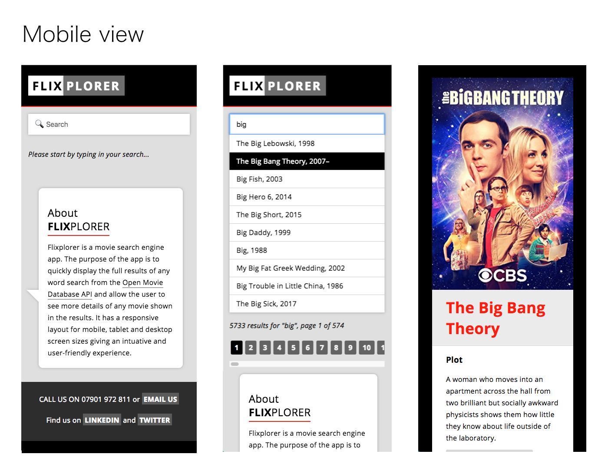
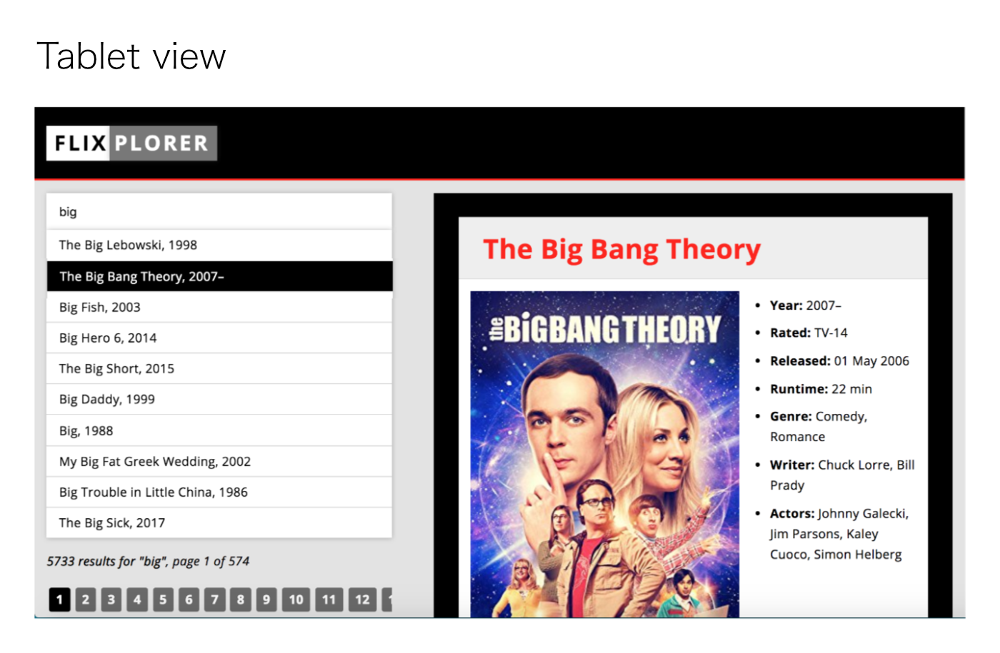

# 'FLIXPLORER' movie search engine
---
 
 

## Objective > what does it do?
**FLIXPLORER** is a movie search engine app. Its purpose is to display results of a search query efficiently and give the user full details of movies shown in the results. It has a responsive layout for mobile and desktop screen sizes giving an intuative and user-freindly experience.

## Functionality > How does it work?
+ The app first captures the search input and fetches data that matches the input from the [Open Movie Database](http://www.omdbapi.com) API. 
+ The app then uses Javascript and CSS to display the data returned by the API as pages of links, with 10 links per page. 
+ Each link has a unique ID which is used to identify the selected movie from the API.
+ Each time a movie is selected, the title, poster image, description and other details are displayed

> [View FLIXPLORER repo on Github](https://github.com/rolandjlevy/project-cinema)

## Technology used
+ Open Movie Database API
+ Javascript
+ CSS

## Stages of development
+  Set up API and read the **Open Movie Database API** documentation 
+  Created funcitonality for the initial search query
+  Created smart pagination, with scrolling to see all results
+  Retrieved the data for selected movie 
+ Used Javascript to display the poster image, year, IMDB rating, director, description etc...
+ Used CSS to style the UI

## Features
+ Responsive search preview - results update with each letter typed. Initial search results are shown below the search box
+ Smart pagination so that users can quickly navigate between all movies in search results
+ Form validation giving the user feedback and details of results:
... + if the search input is more than 3 letters
⋅⋅⋅ + if the search input has returned a valid result or not
... + How many results and pages of results found

## Problems and errors to be fixed
+ Fix errors with the search input field. Searching more than one word created errors with the results.
+ Improve the tablet and desktop views for better responsiveness

## Desired features with more time
+ Include infinate scrolling with the initial results
+ Use the [Youtube API](https://developers.google.com/youtube/v3/) to load a trailer into the detailed results area
+ Display a relevant poster when no image was available from the **Open Movie Database**
+ Create a sortable favourites list and display it on the page
